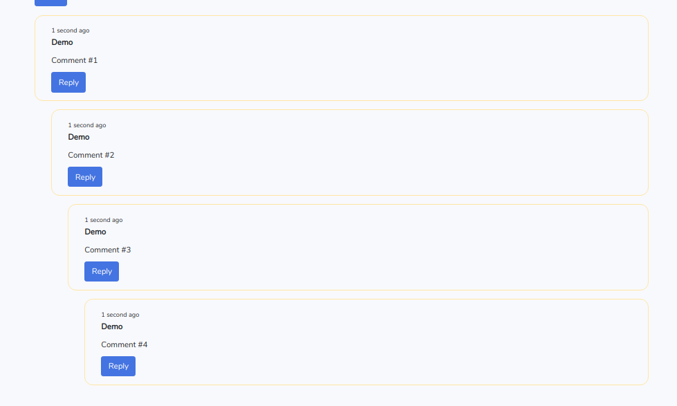

# Demo Laravel-comment package

* Link to package [yarmat/laravel-comment](https://github.com/yarmat/laravel-comment)
* Link to demo-page [Demo](http://comment-demo.yarmat.su)

## Installing
Step 1
<pre>
clone https://github.com/yarmat/laravel-comment.git ./
</pre>

Step 2 
<pre>
composer install
</pre>

Step 3
<pre>
npm install
</pre>

Step 4
```php
php artisan migrate
```

Step 5
```php
php artisan db:seed
```

## Screenshots





## License

The Demo Laravel-comment is open-sourced software licensed under the [MIT license](https://opensource.org/licenses/MIT).
